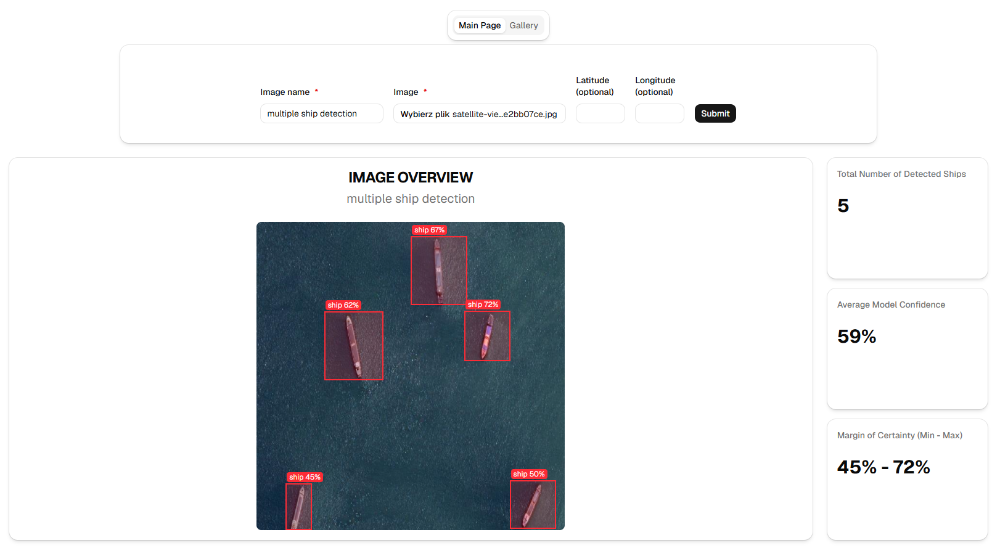
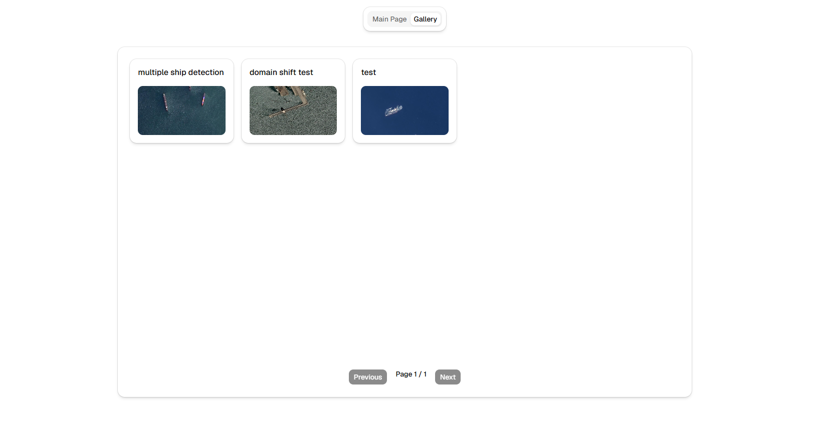
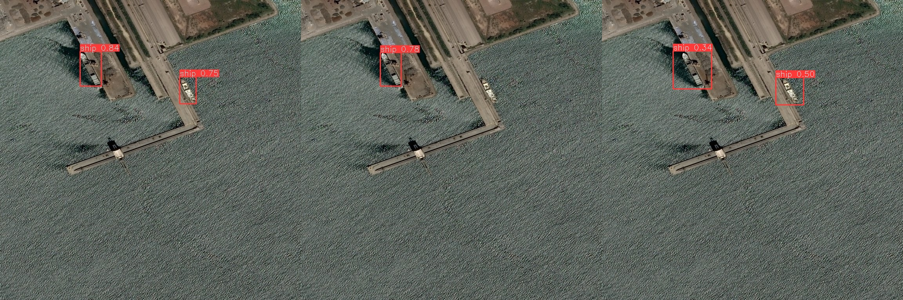
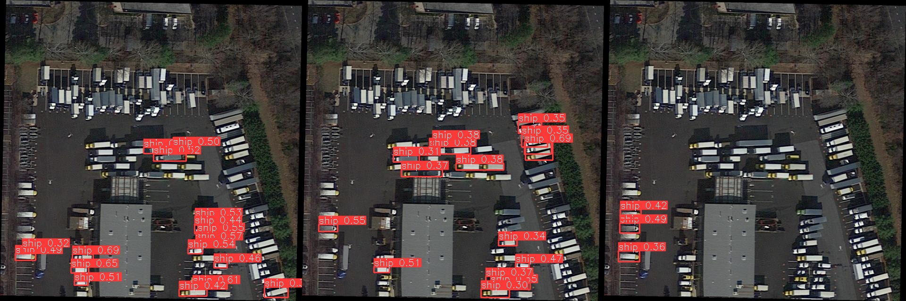
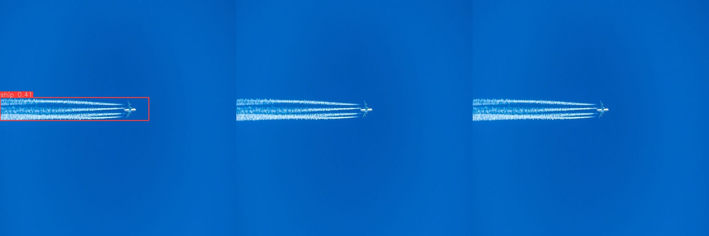
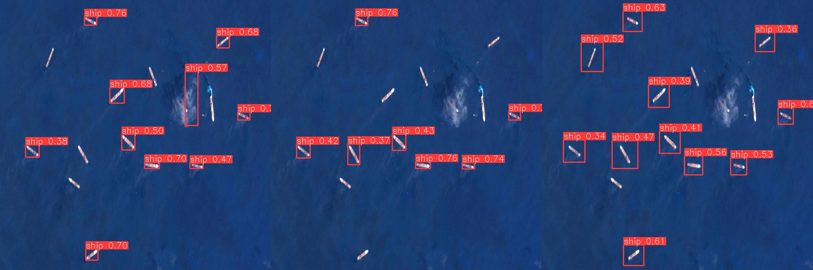
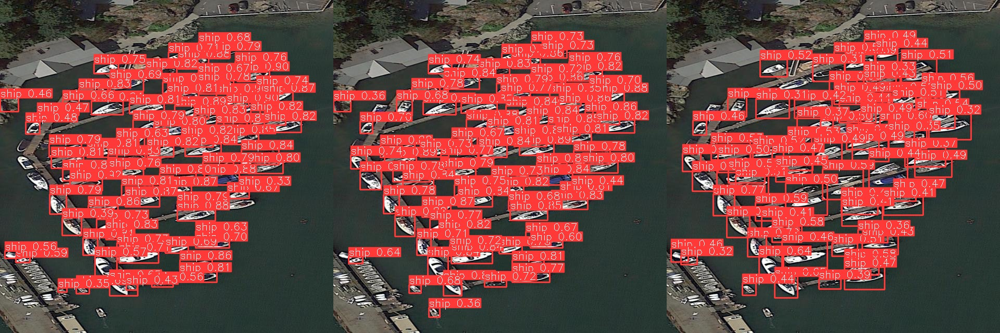
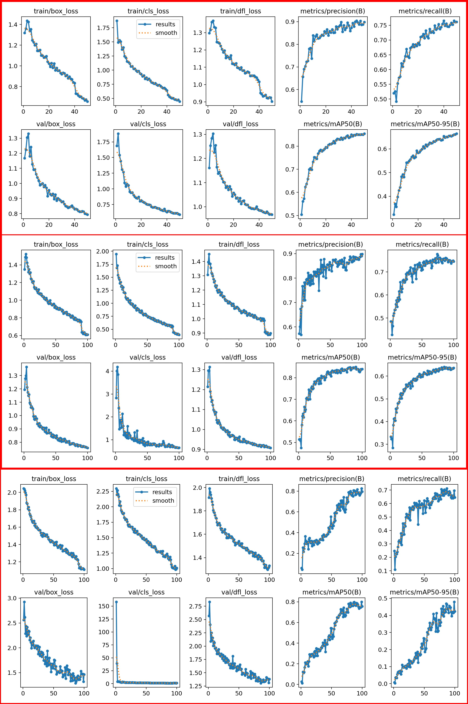

# Satellite Analysis Dashboard

Satellite Analysis Dashboard is a full-stack web application designed for automated maritime surveillance. The system allows users to upload high-resolution satellite imagery and employs a custom-trained Deep Learning model to detect ships and vessels. 

The primary goal of this project was to explore the end-to-end pipeline of a Machine Learning product: from training object detection networks to deploying a scalable, containerized web service.

## Architecture & Tech Stack

* **Frontend:** React, Tailwind CSS, shadcn/ui
* **Backend:** Django, Django Rest Framework
* **Database:** PostgreSQL
* **Task Queue & Background Processing:** Celery for event-driven, asynchronous AI inference, eliminating inefficient database polling and ensuring scalable background execution.
* **AI / Computer Vision:** YOLOv8 (PyTorch) integrated with SAHI for processing large-scale imagery without downscaling loss.
* **Monitoring:** Flower for real-time tracking of Celery task queues
* **Infrastructure:** Docker & Docker Compose

## Application Overview

| Detection Dashboard | Image Gallery |
|:---:|:---:|
|  |  |

## Quick Start (Local Setup)

The project is fully containerized. To run it locally:

1. **Clone the repository:**
```bash
git clone --branch v0.1.0-mvp https://github.com/Emmes1026/Satellite-Analysis-Dashboard.git

cd Satellite-Analysis-Dashboard
```

2. **Configure environment variables:**

Rename .env.example to .env and fill in your local database credentials.
```bash
cp .env.example .env
```

3. **Build and start the containers:**
```bash
docker compose up --build
```
**Note on First Run:** During the initial startup, the AI Worker container will automatically fetch the custom-trained weights file (ships.pt, ~50MB) directly from the GitHub Release assets. 

4. **Access the services:**
Once the containers are up and running, you can access the following services in your browser:

* Frontend Web App: http://localhost:3000

* Django Admin Dashboard & API Backend: http://localhost:8000

* Flower (Celery Monitoring): http://localhost:5555

## Model Evolution & Performance

The core of the detection system is built upon the YOLOv8 architecture. Throughout the development process, the model underwent several iterations to balance detection accuracy and False Positive rejection.

| Version | Architecture | Primary Focus / Dataset Changes | Key Observations |
|:---:|:---:|---|---|
| **v4** | YOLOv8s | Initial baseline training. | High recall but severe overconfidence. Prone to False Positives on clouds and plane images. |
| **v5** | YOLOv8s | Dataset augmentation targeting background noise. | Better background rejection, but prone for overfitting. |
| **v6 (Current)** | YOLOv8m | Architectural scale-up to capture deeper features. | Better false positives rejection and domain shift handling but visible drop in confidence |

### Visual Comparison

The graphic below demonstrates how the model's prediction capabilities evolved on the same challenging satellite images. Models are placed in order **v4-v5-v6**

<details>
  <summary><b>Test 1: Domain Shift Handling</b></summary>
  <br>
  <p>Test demonstrating model capabilities in a different environment than what was normally present in the dataset.</p>
  
</details>

<details>
  <summary><b>Test 2: False Positives - Parked Cars</b></summary>
  <br>
  <p>Test demonstrating model capabilities with cars similarly placed as docked ships.</p>
  
</details>

<details>
  <summary><b>Test 3: False Positives - Planes</b></summary>
  <br>
  <p>Test demonstrating model capabilities in distinguishing planes from ships.</p>
  
</details>

<details>
  <summary><b>Test 4: Cloud Noise Rejection</b></summary>
  <br>
  <p>Test demonstrating model capabilities with disorganized ships in the presence of a small cloud.</p>
  
</details>

<details>
  <summary><b>Test 5: Tightly Docked Ships</b></summary>
  <br>
  <p>Test demonstrating model capabilities in distinguishing one docked ship from another in a tight environment.</p>
  
</details>

### Performance Analysis

The charts below illustrate the training process across different model generations. While **v5** achieved the highest overall metrics on paper, **v6 (YOLOv8m)** was selected for the final MVP deployment due to its superior real-world calibration and extreme resistance to environment noise.

| Model Version | Architecture | Dataset Size (Background Images) | Peak mAP50 | Key Takeaway |
|:---:|:---:|:---:|:---:|---|
| **v4** | YOLOv8s | ~2000 | ~0.84 | Fast convergence but heavily overconfident; high false-positive rate. |
| **v5** | YOLOv8s | ~2000 + Augm. | **~0.86** | Most stable training curves. |
| **v6 (Current)** | YOLOv8m | ~2000 (~120 Background) | ~0.80 | Massive spike in initial validation loss. Better real-world precision. |

<details>
  <summary><b>View Detailed Training Curves (v4 vs v5 vs v6)</b></summary>
  <br>
  
</details>

### Dataset

The model was trained on a custom-curated dataset. The core training data consists of the **HRSC2016** dataset, augmented with supplementary imagery from **Roboflow Universe** and manually sourced satellite images. This combination was explicitly designed to handle domain shift and false positives.

To ensure robust evaluation and prevent data leakage, the model's inference capabilities were tested on a completely independent hold-out set. This evaluation set features imagery sourced from:
* The **DOTA**
* The **Kaggle: Airbus Ship Detection Challenge**
* The **Copernicus Browser**
* Other unrelated, manually selected satellite tiles not present in the training distribution.

## Demo Data

The repository includes a set of sample images in the samples/ directory to easily test the capabilities of the currently deployed model.

## REST API Endpoints

The system exposes a REST API built with Django REST Framework, that enables communication between the frontend, the AI worker, and the data management layer.

| HTTP Method | Endpoint | Description | Task in system |
|:---:|---|---|---|
| **GET** | `/api/images/` | Photo gallery | Retrieves a paginated list of photos to gallery |
| **POST** | `/api/images/` | Upload photo | Upload new image file to system and automatically delegates new task to Celery |
| **POST** | `/api/detections/` | Save detection | Used by AI worker in order to save detections to database |
| **GET** | `/api/detections/<image_id>/` | Retrieve specific detection results | Retrieve specific detection analysis for main page display |

## Known Limitations & Future Roadmap (MVP Status)

* **GSD (Ground Sample Distance) constraints:**
Very small vessels may lack sufficient pixel density and high-frequency features to be reliably detected in standard optical ranges.

* **Domain Shift:**
The model's accuracy is tied to the weather, water color, and lighting conditions present in the training distribution.

### Future Development Roadmap:

* **[ ] SAR Integration:** 
Migrate the detection pipeline to process Synthetic Aperture Radar data, eliminating optical noise and maximizing vessel contrast.

* **[ ] GeoTIFF Support:** 
Implement rasterio / GDAL to read spatial metadata and dynamically adjust inference parameters based on the image's GSD.

## License

This project is licensed under the MIT License - see the [LICENSE](LICENSE) file for details.

## Contact & Author

* **GitHub:** [@Emmes1026](https://github.com/Emmes1026)
* **LinkedIn:** [https://www.linkedin.com/in/suszkofilip/](https://www.linkedin.com/in/suszkofilip/)
* **Email:** [suszko.filip2000@gmail.com](mailto:suszko.filip2000@gmail.com)

Project Link: [https://github.com/Emmes1026/Satellite-Analysis-Dashboard](https://github.com/Emmes1026/Satellite-Analysis-Dashboard)


